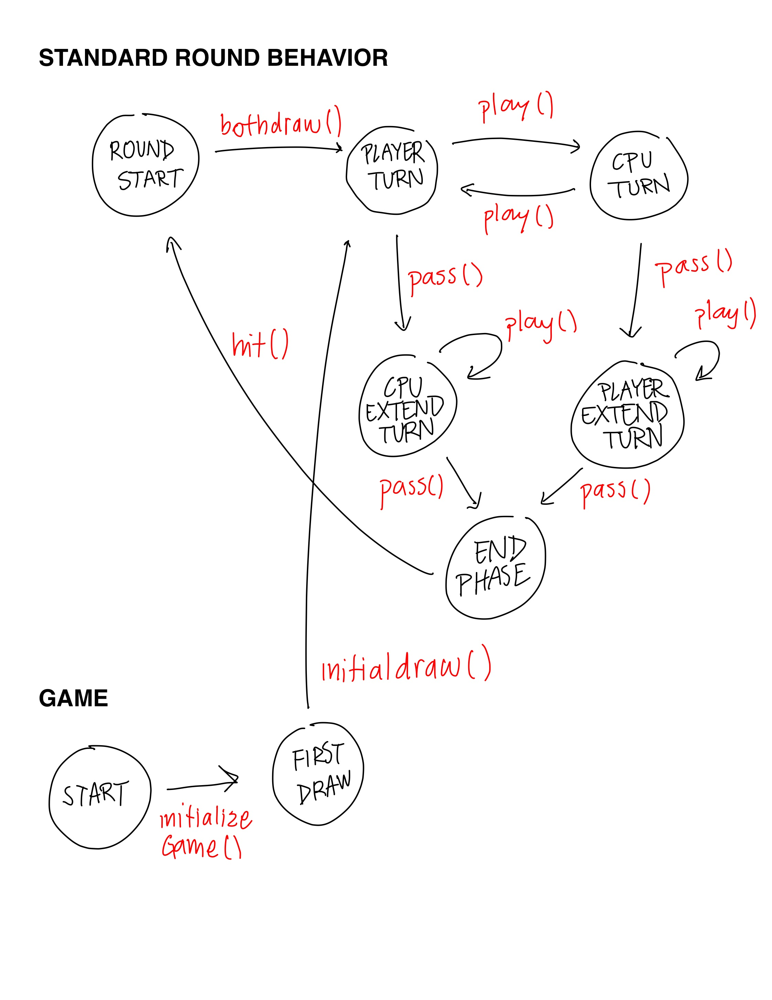

# Gwen't

This work is licensed under a
[Creative Commons Attribution 4.0 International License](http://creativecommons.org/licenses/by/4.0/)

Context
-------

This project's goal is to create a (simplified) clone of the
[_Gwent_](https://www.playgwent.com/en) card game developed by [_CD PROJEKT RED_](https://cdprojektred.com/en/)

---

Class/Trait Rundown
-------
Below is the list of classes for this project with a brief description.

+ **board package**
  + UnitBoard: Corresponds to the zone where unit cards are played. The zone is divided in three sub-zones; one for each type on unit card.
  + Board: The general board of a game. Consists of two *UnitBoards*, one for each player, and a slot for the weather card.
+ **card package**
  + Card: Interface for cards in the game. Represents the most general aspects of a card. To be used as type for the rest of the classes. *WeatherCard* and *AbsUnitCard* extend directly from this trait.
  + AbsUnitCard: Abstract class representing the unit cards in the game, these are the cards that are played in the *UnitBoard* and have strength value. *MeleeCard*, *RangedCard* and *SiegeCard* extend directly from this class.
    + MeleeCard: Represents the cards that are played in the close combat section of the *UnitBoard*.
    + RangedCard: Represents the cards that are played in the ranged combat section of the *UnitBoard*.
    + SiegeCard: Represents the cards that are played in the siege section of the *UnitBoard*.
  + WeatherCard: Represents the weather cards that are played in the weather slot of the board.

+ **handler package**
  + Deck: Represents a deck of cards in the game. Holds cards up to a capacity specified when creating the deck. This is from where cards are drawn while playing the game.
  + Hand: Represents a hand of cards in the game. Holds cards up to a capacity specified when creating the hand. When cards are drawn from the deck, they are added to the hand. Cards are played from the hand into the board.
+ **players package**
  + Player: Represents the player played by the user. Their cards are put in the player's side of the board.
  + Computer: Represents the CPU that plays against the player controlled by the user. Their cards are played in the computer's section on the board.
  + AbsPlayer: Abstract class representing common characteristics of both players types.
---

Important methods
-------
List of relevant methods' implementation.

#### Using double dispatch for card placement.

+ `play(index: Int): Unit` in the Player and Computer class. Defined differently in both classes, implements the placement of cards using double dispatch. This method sends a message to the card, calling a different method whether a Player or a Computer objects is placing the card.
+ `placeOnPlayer(board: Board): Unit` in the Card interface. Every card type implements this method. This method is called by a Player object when playing cards. This method sends a message to the board received to place the Card on the corresponding section depending on its type.
+ `placeOnComputer(board:Board): Unit` in the Card interface. Analogous to the previous method, sends a message to the board to place the card in the Computer's section corresponding to the card's type.
+ `placeMelee(card: MeleeCard): Unit` in the UnitBoard class. Receives a melee card and places it in the melee card section.
+ `placeRanged(card: RangedCard): Unit` in the UnitBoard class. Receives a ranged card and places it in the ranged card section.
+ `placeSiege(card: SiegeCard): Unit` in the UnitBoard class. Receives a siege card and places it in the siege card section.
+ `placeWeather(card: WeatherCard): Unit` in the Board class. Receives a weather card and places it in the weather slot.

Please read documentation in each class for more details.

---

States of the game
-------
#### State pattern implementation to model game flow

---

