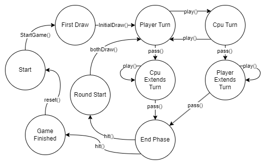

# Gwen't

This work is licensed under a
[Creative Commons Attribution 4.0 International License](http://creativecommons.org/licenses/by/4.0/)

Context
-------

This project's goal is to create a (simplified) clone of the
[_Gwent_](https://www.playgwent.com/en) card game developed by [_CD PROJEKT RED_](https://cdprojektred.com/en/)

---

Class/Trait Rundown
-------
Below is the list of classes for this project with a brief description.

+ **board package**
  + UnitBoard: Corresponds to the zone where unit cards are played. The zone is divided in three sub-zones; one for each type on unit card.
  + Board: The general board of a game. Consists of two *UnitBoards*, one for each player, and a slot for the weather card.
+ **card package**
  + Card: Interface for cards in the game. Represents the most general aspects of a card. To be used as type for the rest of the classes. *WeatherCard* and *AbsUnitCard* extend directly from this trait.
  + AbsUnitCard: Abstract class representing the unit cards in the game, these are the cards that are played in the *UnitBoard* and have strength value. *MeleeCard*, *RangedCard* and *SiegeCard* extend directly from this class.
    + MeleeCard: Represents the cards that are played in the close combat section of the *UnitBoard*.
    + RangedCard: Represents the cards that are played in the ranged combat section of the *UnitBoard*.
    + SiegeCard: Represents the cards that are played in the siege section of the *UnitBoard*.
  + WeatherCard: Represents the weather cards that are played in the weather slot of the board.

+ **handler package**
  + Deck: Represents a deck of cards in the game. Holds cards up to a capacity specified when creating the deck. This is from where cards are drawn while playing the game.
  + Hand: Represents a hand of cards in the game. Holds cards up to a capacity specified when creating the hand. When cards are drawn from the deck, they are added to the hand. Cards are played from the hand into the board.
+ **players package**
  + Player: Represents the player played by the user. Their cards are put in the player's side of the board.
  + Computer: Represents the CPU that plays against the player controlled by the user. Their cards are played in the computer's section on the board.
  + AbsPlayer: Abstract class representing common characteristics of both players types.
---

Important methods
-------
List of relevant methods' implementation.

#### Using double dispatch for card placement.

+ `play(index: Int): Unit` in the Player and Computer class. Defined differently in both classes, implements the placement of cards using double dispatch. This method sends a message to the card, calling a different method whether a Player or a Computer objects is placing the card.
+ `placeOnPlayer(board: Board): Unit` in the Card interface. Every card type implements this method. This method is called by a Player object when playing cards. This method sends a message to the board received to place the Card on the corresponding section depending on its type.
+ `placeOnComputer(board:Board): Unit` in the Card interface. Analogous to the previous method, sends a message to the board to place the card in the Computer's section corresponding to the card's type.
+ `placeMelee(card: MeleeCard): Unit` in the UnitBoard class. Receives a melee card and places it in the melee card section.
+ `placeRanged(card: RangedCard): Unit` in the UnitBoard class. Receives a ranged card and places it in the ranged card section.
+ `placeSiege(card: SiegeCard): Unit` in the UnitBoard class. Receives a siege card and places it in the siege card section.
+ `placeWeather(card: WeatherCard): Unit` in the Board class. Receives a weather card and places it in the weather slot.

Please read documentation in each class for more details.

---

States of the game
-------
#### State pattern implementation to model game flow

The controller mandates the game flow using the state pattern to simulate the rounds of the game. Every controller 
starts in the StartState, and is waiting for the StartGame method to enter a game state. Game state is a boolean; it's 
true when some game is currently being played. 

When the method StartGame() is called, the controller goes to state FirstDraw. In the FirstDraw state, the only valid 
transition is InitialDraw(), which when called makes both players in the controller draw 10 cards.

When InitialDraw() is called, the controller goes to state PlayerTurn. The human player always goes first. In this
state, the controller can use the pass() and play() transition. If play() is used, some index needs to be given,
to play a card from the hand of the human player in the board. After using that transition, the controller goes into
CpuTurn state. Lastly, if pass() is used, nothing is played and the controller goes into CpuExtendTurn state.

The CpuTurn state operates the same way as the PlayerTurn state, with the only difference being the state it 
transitions to. 

If pass() is played while being in the PlayerTurn state, the controller goes to CpuExtendTurn. In this state, the
controller can use the play() and pass() transitions also. But, if the controller calls the play() transition, it
stays in the same state. If pass() is used, the controller transitions to EndPhase state.

PlayerExtendTurn is analogous to CpuExtendTurn.

In the EndPhase state, only the hit() transition can be used. The hit() method receives information of the controller's
board regarding the total strength of both players. Using those parameters, decides which player to hit and handles the
ending of the game if someone has reached 0 gems, through observer patter (more on that later).

If the condition of ending the game is not met, then hit() makes the controller transition to RoundStart state.

In RoundStart state, the only transition possible is bothDraw() which makes both players draw 3 cards, and changes the
controller's state to PlayerTurn again.

Finally, the cycle repeats until the hit() transition receives information from the controller that the game has ended.
Then, hit() makes the controller transition to GameFinished, where only the reset() transition can be used. While being
on the GameFinished state, the reset() transition resets the board and sets the controller's state to Start.

---

Effects
-------
Effects are implemented defining the apply method. When a card is places on the board, it calls 
the apply method, with the target parameter being the row is being placed in.

The apply method for WeatherCard is defined in the AbsWeatherEffect class, because all weather effects
operate in the same way. The only difference is where they are applied in the board. That's why, only
for WeatherCard objects, the method activate is also defined. The activate method receives the board
where the card is being placed in. Each concrete weather effect knows in which rows it needs to be applied,
so each concrete class overrides the activate method calling the onMelee, onRanged, onSiege method in the
class UnitBoard. This way, the Board is the only one tasked with applying the effects on the rows and only
receives information about how to apply them from the Effect class.
---

Observer
-------
The controller needs to know when some player has lost all gems. For that, the controller and players implement the
Observer and ISubject interface, respectively.

The controller observes the players, and wants to know which one wins. Because of that, the observer interface defines
two updates methods; one for the player and one for the cpu. When the players are hit, the concrete player of type 
Computer calls the UpdateCpu method, while the concrete player of type Player calls the updatePlayer method.

On the other hand, the AbsPlayer implements the method notifyObserver in the ISubject interface. Which passes the 
amount of gems remaining as argument for the controller.

Finally, both the updatePlayer and updateCpu methods checks if the argument received is 0. If so, it ends the game by
changing the boolean saved in gameState variable. If the argument received is higher than 0, then it prints the amount
with some message.
---